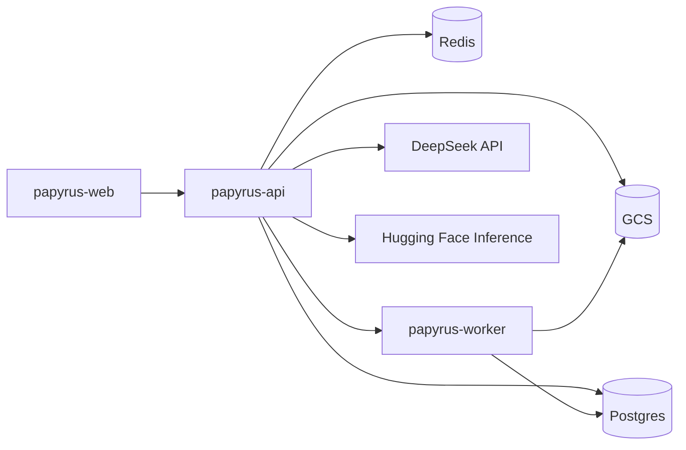

# Papyrus on Google Cloud Run

Serverless deploy: **API**, **Celery worker**, and **static web**. PDF ingestion is **PyMuPDF only** (no GROBID image in this pipeline).

## Architecture

| Component | Role |
|-----------|------|
| `papyrus-api` | FastAPI, uploads to GCS, PyMuPDF parse, enqueues Celery |
| `papyrus-worker` | Celery worker (`--min-instances=1` recommended so queued audits run) |
| `papyrus-web` | React static site; `VITE_API_BASE_URL` points at API URL |
| Supabase / Neon | `DATABASE_URL` (`postgresql+psycopg2://...?sslmode=require`) |
| Redis Cloud / Upstash | `REDIS_URL` broker + cache |
| GCS | `FILE_STORAGE_BACKEND=gcs`, `GCS_BUCKET` |



## Defaults (cost and safety)

| Variable | Value | Why |
|----------|-------|-----|
| `GROBID_ENABLED` | `false` | No GROBID service on Cloud Run |
| `ENABLE_LLM_PDF_INGESTION` | `false` | Avoid LLM hallucination on bibliography |
| `LLM_BACKEND` | `deepseek` | Intent/claims via DeepSeek API |
| `NLI_BACKEND` | `hf` | Hugging Face Inference |
| `EMBEDDINGS_BACKEND` | `snowflake` | Arctic embed via HF |

`deploy.ps1` injects `GROBID_ENABLED=false` and `ENABLE_LLM_PDF_INGESTION=false` on deploy.

## LLM providers

| Task | Configuration |
|------|----------------|
| Citation intent + claim text | `LLM_BACKEND=deepseek` + `DEEPSEEK_API_KEY` + `DEEPSEEK_MODEL` (e.g. `deepseek-v4-flash`) |
| Same, via OpenRouter | `LLM_BACKEND=openrouter` + `OPENROUTER_API_KEY` + `OPENROUTER_MODEL` (e.g. `openrouter/owl-alpha`) |
| PDF bibliography / references | **PyMuPDF only** — not LLM unless you set `ENABLE_LLM_PDF_INGESTION=true` after prompt work |

DeepSeek-hosted models use **api.deepseek.com**, not OpenRouter, unless you deliberately choose an OpenRouter slug with `LLM_BACKEND=openrouter`.

## Prerequisites

1. GCP project with billing (Cloud Run, Cloud Build, GCS).
2. `gcloud auth login` and `gcloud config set project PROJECT_ID`.
3. Supabase (or Neon) database URL and Redis Cloud URL.
4. API keys: DeepSeek and/or OpenRouter, Hugging Face (NLI + embeddings), resolver mailtos.

## Production checklist

| Step | Action |
|------|--------|
| 1 | Copy `deploy/cloudrun/env.template` → `deploy/cloudrun/.env` |
| 2 | Fill Postgres, Redis, GCP project, API keys, real mailtos |
| 3 | `cd backend && python scripts/init_db.py` (or `INIT_DB=1` on deploy script) |
| 4 | `.\deploy\cloudrun\deploy.ps1` from repo root |
| 5 | Set `CORS_ORIGINS` to web URL; redeploy with `$env:SKIP_WEB='1'` |

`APP_ENV=production` enforces real contact emails, `GCS_BUCKET`, Postgres persistence, and LLM/NLI API keys (see `backend/app/config.py`).

## One-time database setup

```bash
cd backend
pip install -r requirements.txt
export DATABASE_URL="postgresql+psycopg2://..."   # same as deploy .env
python scripts/init_db.py
```

Creates SQLAlchemy tables in Postgres (`init_db` in `app.db.session`).

## Deploy steps

1. Copy `deploy/cloudrun/env.template` to `deploy/cloudrun/.env` and fill values.
2. From repo root:

   ```powershell
   .\deploy\cloudrun\deploy.ps1
   ```

   Linux/macOS: `chmod +x deploy/cloudrun/deploy.sh && ./deploy/cloudrun/deploy.sh`

3. After first run, set `CORS_ORIGINS` to the **papyrus-web** URL and redeploy API/worker only:

   ```powershell
   $env:SKIP_WEB = "1"
   .\deploy\cloudrun\deploy.ps1
   ```

See [deploy/cloudrun/README.md](../deploy/cloudrun/README.md) for script options (`INIT_DB`, `SKIP_WEB`).

## GCS

The deploy script creates `gs://$GCS_BUCKET` if missing and grants **Storage Object Admin** to the default Cloud Run service account (`PROJECT_NUMBER-compute@developer.gserviceaccount.com`).

## Worker scaling

- **`min-instances=0` on worker:** audits enqueue but may not run until a cold start; risky for demos.
- **`min-instances=1`:** worker always listens; adds steady cost (~similar to a small always-on container).

API can scale to zero; worker usually should not if you rely on Celery for all audits (`USE_CELERY_BACKGROUND=true`).

## Enabling GROBID later (public beta)

Not part of `deploy.ps1` today.

1. Deploy `grobid/grobid:0.8.0` on Cloud Run with **≥ 4 GiB** memory or on a VM.
2. Set `GROBID_ENABLED=true` and `GROBID_URL` on API and worker services.
3. Redeploy.

Locally: `docker compose --profile grobid up -d grobid` and `GROBID_ENABLED=true` in `.env`.

## Live deployment (papyrus-audit)

| Service | URL |
|---------|-----|
| Web | https://papyrus-web-694307068650.us-central1.run.app |
| API | https://papyrus-api-694307068650.us-central1.run.app |
| Health | https://papyrus-api-694307068650.us-central1.run.app/api/health/detailed |

## Smoke test

1. Open the web URL → upload a PDF.
2. `GET /api/health/detailed` — Postgres and Redis OK; `grobid.skipped` when disabled; `background_queue.celery_worker_available` true when the worker is up.
3. Confirm SSE events on the audit detail page.

## See also

- [configuration.md](./configuration.md)
- [gcp-deployment.md](./gcp-deployment.md)
- Root [README.md](../README.md)
